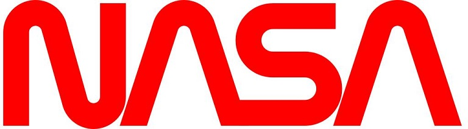

# 诞生
## Python语言诞生于1990年，由荷兰人Guido van Rossum设计并研发(图为Guido)
  
Python的中文意思为蟒蛇，1989年12月，Guidio为了打发圣诞节的时间，决定为当时正在构思的新的脚本语言写一个解释器，因此在次年诞生了Python语言，该语言的命名来源于Guido喜爱的一个英国喜剧组合[Monty Python](https://baike.baidu.com/item/Monty%20Python/10416694?fr=aladdin)
# 发展
- 1991年，Python第一个公开发行版发布
- 2000年10月，Python2.0正式发布
解决了其解释器和运行环境的大量问题，使python得到广泛普及
- 2008年12月，Python3.0正式发布
该版本解释器内部完全使用面向对象的方式实现，代价为无法向下兼容Python2.0的既有语法
# 特点
## Python语言设计哲学:优雅，明确，简单
作为一门高级编程语言，python具有很多特点，在此列出一些比较重要的特点：
- **语法简洁**：python语法中没有分号、函数、大括号的约束，没有begin/end，没有类型声明、变量定义、指针，实现相同功能所需的代码行数，python只有其他语言的10%到20%，以打印"Hello world"字符串为例：  
  
C语言：
```
#include<stdio.h>

int main()

{

printf("Hello world!");

}
```  
Python语言：
```
print("Hello world!")
```
此外，采用强制缩进（四个空格）表示逻辑关系作为python语法的一部分，提高了代码的可读性，使得代码更加美观
- **粘性扩展**：python具有优异的扩展性，可以通过接口和函数库的方式集成C、C++、Java语言的代码，故python又被称为“**胶水语言**”
- **开源生态**：世界各地的程序员每年在开源社区发布的python第三方库超过两万个，python语言目前提供超过14万个第三方库免费使用，底层可封装C/C++等语言的代码，让我们可以站在巨人的肩膀上进行编程
- **跨平台**：python可在任何安装解释器的计算机环境中运行 ，所以python编写的程序可以不加修改地实现跨平台运行
# 应用
python语言的主要应用场景有：常规软件开发、科学计算、自动化运维、云计算、WEB开发、网络爬虫、数据分析、人工智能等领域
**著名案例：**
1. Google:谷歌在很多项目中用python作为网络应用的后端

2. YouTube:视频分享网站，在某些功能上使用到python

3. NASA : 美国宇航局，从1994年起把python作为主要开发语言

***
# 人生苦短，我用Python!:smile:

