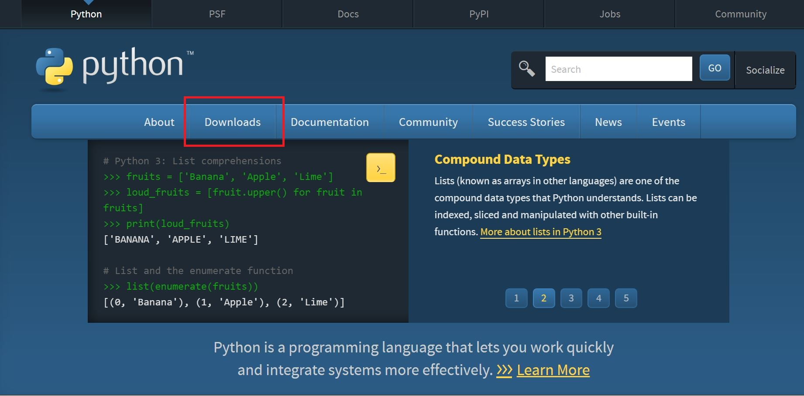
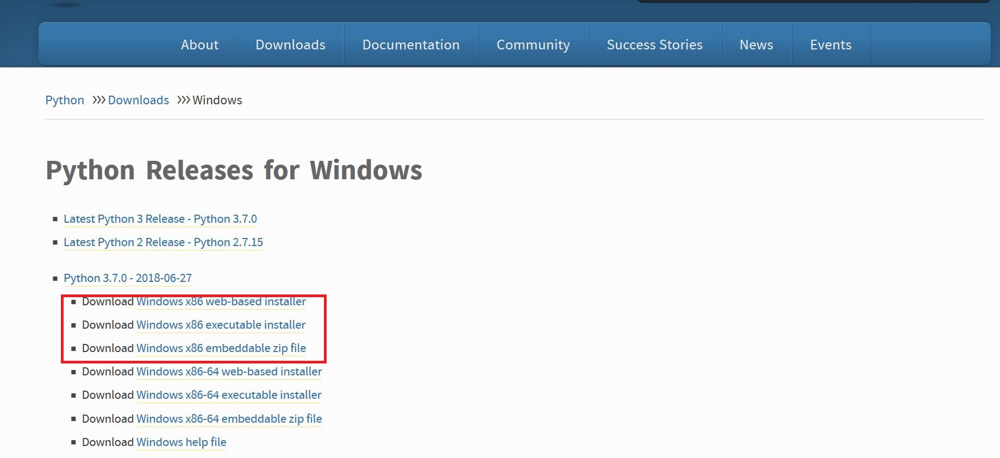
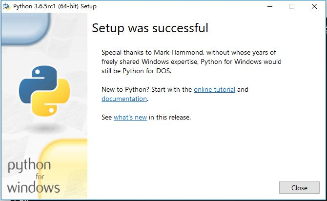

# 安装
1. 进入[Python官网](https://www.python.org/),点击Download

2. 在[下载页](https://www.python.org/downloads/)选择适合自己系统的python3.x版本下载(32位选X86,64位选X86-64)，官网上给出三种安装方式一种为在线安装（web-based installer），第二种为下载安装程序在本地进行安装（executable installer），第三种为下载安装程序的压缩包在本地进行解压安装（embeddable zip file），一般情况下我们使用第二种安装方式

3. 双击下载的程序安装python解释器，在引导页面中选择安装路径并勾选Add Path 3.x to PATH复选框，从而将解释器添加到系统环境变量中使得命令行程序（cmd.exe）可以调用解释器,然后点击"Install Now"

4. 然后一直选择下一步直到提示安装成功(Setup was successfully)

# 运行
# 个性化你的IDLE
# 让我们一起开始激动人心的Python学习之旅吧~:smile:
