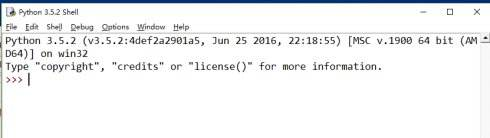
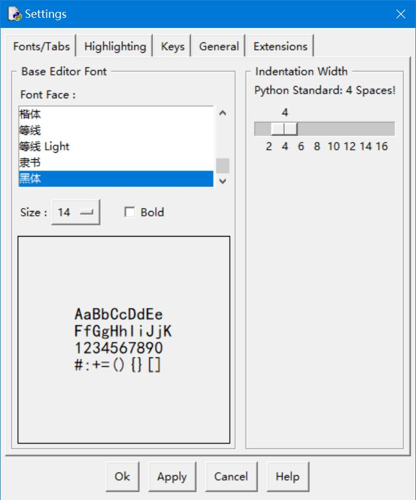
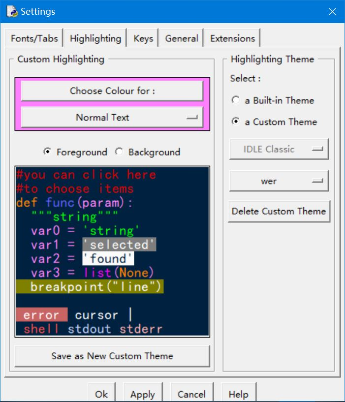

# 安装
1. 进入[Python官网](https://www.python.org/),点击Download

2. 在[下载页](https://www.python.org/downloads/)选择适合自己系统的python3.x版本下载(32位选X86,64位选X86-64)，官网上给出三种安装方式一种为在线安装（web-based installer），第二种为下载安装程序在本地进行安装（executable installer），第三种为下载安装程序的压缩包在本地进行解压安装（embeddable zip file），一般情况下我们使用第二种安装方式

3. 双击下载的程序安装python解释器，在引导页面中选择安装路径并勾选Add Path 3.x to PATH复选框，从而将解释器添加到系统环境变量中使得命令提示符（cmd.exe）可以调用解释器,然后点击"Install Now"

4. 然后一直选择下一步直到提示安装成功(Setup was successfully)

# 运行
安装成功后，打开cmd.exe,输入python后回车，会出现类似图中的字样

# 个性化你的IDLE
打开你的IDLE

是不是感觉界面很丑？没关系！打开options-configure IDLE，让我们来自定义一套属于自己的主题
## 选择字体字号

## 选择颜色

效果如下

# 一些重要的快捷键
在开始编程之前，我们首先要了解一下IDLE中的一些常用快捷键，这会极大提升你的编程速度
Ctrl+N:在IDLE的交互界面下，启动IDLE编辑器
Ctrl+Q:在IDLE编辑器内，退出IDLE或IDLE编辑器
Alt+3:注释选中区域文本
Alt+4:解除选中区域的注释
Alt+Q:将Python代码进行格式化布局
F5:执行Python程序
# 让我们一起开始激动人心的Python学习之旅吧~:smile:
